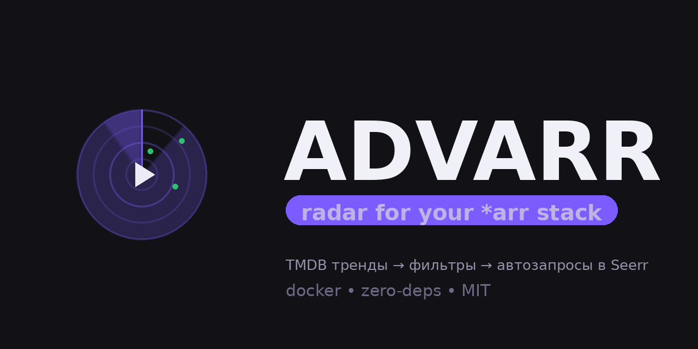
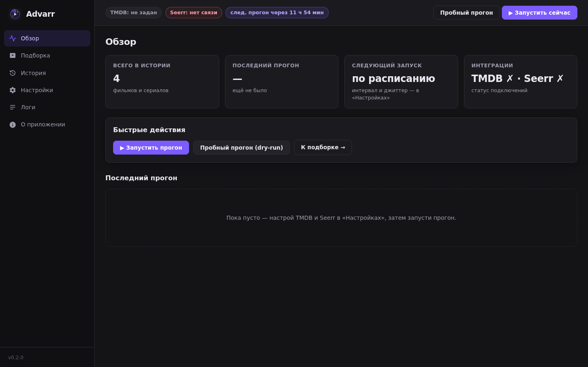
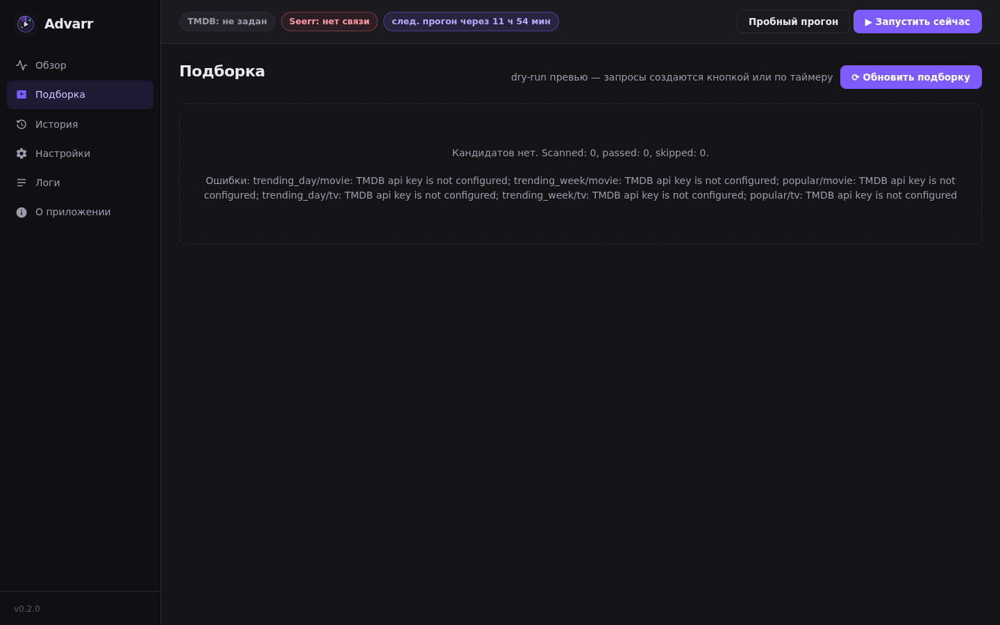
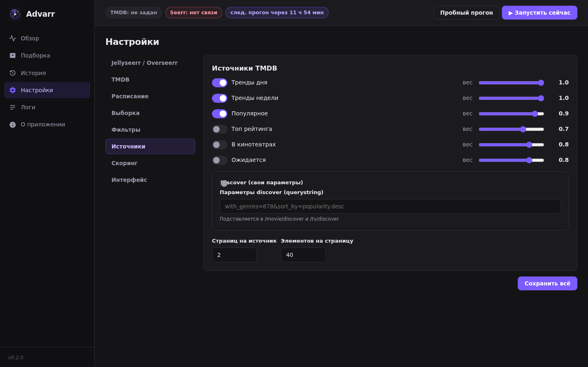

<div align="center">



# Advarr

**Пассивный радар трендов для твоего \*arr-стека.** По таймеру сканирует TMDB
(тренды, популярное, топ-рейтинг), фильтрует «нормисский шум» по твоим правилам
и сам создаёт запросы в **Jellyseerr / Overseerr** через API.
Пока ты не трогаешь ничего — очередь запросов пополняется сама.

`docker` · `zero npm-deps` · `Node 22` · `MIT`

[Быстрый старт](#быстрый-старт) · [Как это работает](#как-это-работает) · [Настройка](#настройка) · [Hardening](#безопасностьhardening)

</div>

---

## Что это

Advarr сидит между TMDB и твоим Seerr и делает ровно одну вещь: **периодически находи и проси**.

- ⏱ **Таймер**: раз в N часов (с джиттером ±M мин, чтобы не бить по API в такт с миром).
- 🌍 **Источники «шума»**: `trending/day`, `trending/week`, `popular`, `top_rated`, `now_playing`, `upcoming`, `discover` (свои параметры) — у каждого тумблер и вес.
- 🎚 **Фильтры**: минимальный рейтинг и число голосов, годы, языки оригинала, включённые/исключённые жанры, 18+.
- 🧮 **Скоринг**: настраиваемые веса (рейтинг / популярность / голоса / свежесть / любимые жанры) — теперь «нашумевшее» определяется твоими правилами, а не глобальным миндом TMDB.
- 🔁 **Без повторов**: дедуп по локальной истории + всем существующим запросам в Seerr + опциональная проверка статуса медиа (pending/available → скип).
- 🖥 **Radarr-подобная веб-морда**: сайдбар, карточки с постерами и score-бейджами, история, логи, все настройки в UI.
- 🐳 **Docker**: zero-deps образ, non-root, read-only rootfs, healthcheck, GHCR multi-arch.

## Как это работает

```text
┌────────────┐  каждые N часов   ┌────────────────────────────────────┐
│  Scheduler │──────────────────▶│ 1. TMDB: тренды/популяр/топ/…      │
└────────────┘                   │ 2. фильтры + скоринг + ранжирование │
                                 │ 3. дедуп: история + запросы Seerr  │
      ┌────────────────┐         │ 4. топ M фильмов + K сериалов      │
      │ Jellyseerr /   │◀────────│ 5. POST /api/v1/request            │
      │ Overseerr      │         └────────────────────────────────────┘
      └───────┬────────┘
              ▼
        Radarr / Sonarr
```

## Быстрый старт

### Docker Compose (рекомендуется)

```bash
mkdir advarr && cd advarr
curl -O https://raw.githubusercontent.com/stelgen/advarr/main/docker-compose.yml
curl -o .env https://raw.githubusercontent.com/stelgen/advarr/main/.env.example
# заполни TMDB_API_KEY (themoviedb.org → Settings → API) и SEERR_URL/SEERR_API_KEY
docker compose up -d
```

Открой `http://localhost:8787` → **Настройки** → проверь TMDB и Seerr кнопками
**Проверить** → **Сохранить** → **Подборка** → **Обновить подборку** (пробный прогон).

> 💡 Ключи можно вообще не вносить руками в UI: `TMDB_API_KEY`, `SEERR_URL`,
> `SEERR_API_KEY` из env засеиваются в конфиг при первом старте (потом UI-правки главнее).

### docker run

```bash
docker run -d --name advarr \
  -p 8787:8787 \
  -v ./data:/app/data \
  -e TMDB_API_KEY=your_key \
  -e SEERR_URL=http://192.168.1.50:5055 \
  -e SEERR_API_KEY=your_seerr_key \
  ghcr.io/stelgen/advarr:latest
```

## Скриншоты

| Обзор | Подборка (dry-run) | Настройки |
|---|---|---|
|  |  |  |

## За reverse-proxy (nginx/traefik)

Нормально себя чувствует: без вебсокетов и sticky-сессий. Подними `proxy_read_timeout` до 300s
dля длинных dry-рuv-прогонов и выставь `TRUST_PROXY=1`, чтобы rate-limit видел реальные IP —
подробности в [docs/REVERSE-PROXY.md](docs/REVERSE-PROXY.md).

## Настройка

Всё — в веб-морде (разделы как в *arr): **Jellyseerr/Overseerr · TMDB · Расписание · Выборка · Фильтры · Источники · Скоринг**.

| Env (сид/секреты) | По умолчанию | Описание |
|---|---|---|
| `ADVARR_PORT` | `8787` | Порт |
| `ADVARR_DATA_DIR` | `/app/data` | Каталог данных (`config/history/runs.json`) |
| `TMDB_API_KEY` | — | Ключ TMDB v3 |
| `SEERR_URL` | — | Базовый URL Jellyseerr/Overseerr |
| `SEERR_API_KEY` | — | API-ключ Seerr |
| `BASIC_AUTH_USER` / `BASIC_AUTH_PASS` | — | Basic-Auth на веб-морду |
| `ADVARR_API_KEY` | — | Альтернатива Basic: `X-Api-Key` |
| `TRUST_PROXY` | — | `1` = доверять `X-Forwarded-For` (только за своим прокси) |

Логика выборки: пул кандидатов со включённых источников → фильтры → дедуп
(история + `GET /api/v1/request` в Seerr) → скоринг → квота `moviesPerRun`/`showsPerRun` →
`POST /api/v1/request` (сериалы: все сезоны или только 1-й — настройка `tvSeasons`).

## Безопасность / Hardening

- Ноль npm-зависимостей → минимальная поверхность атаки; база `node:22-alpine` пинится.
- Non-root (uid 10001), `tini`, совместимо с `read_only: true` + `tmpfs` для `/tmp`.
- `cap_drop: ALL`, `no-new-privileges`, лимит логов — всё уже в `docker-compose.yml`.
- Строгий CSP без внешних CDN; постеры проксируются через `/img/poster` (не палит ключи, не светит IP).
- Rate-limit + таймбоди-лимиты + `timingSafeEqual` на проверке секретов.
- Trivy в CI валит билд на HIGH/CRITICAL. Подробности: [docs/SECURITY.md](docs/SECURITY.md).

## Разработка

```bash
git clone git@github.com:stelgen/advarr.git && cd advarr
node server.js            # dev-старт: http://localhost:8787
npm test                  # unit + e2e (node:test, без внешней сети)
python3 scripts/gen_brand.py   # перегенерация логотипа/баннера
```

API-контракт: [docs/API.md](docs/API.md) · Дизайн-референс: Radarr/Sonarr.

## Roadmap

- [ ] Trakt.tv как источник «нормисского шума»
- [ ] Поддержка прямых API Radarr/Sonarr (в обход Seerr)
- [ ] Списки TMDB (watchlists юзеров, премии)
- [ ] Уведомления (Telegram/Discord webhook)
- [ ] Экспорт/импорт конфига

## Лицензия

MIT — см. [LICENSE](LICENSE).

---

<div align="center"><sub>Сделано с 📡 для домашнего медиа-стека. TMDB — сторонний сервис, Advarr не аффилирован с TMDB/Overseerr/Jellyseerr.</sub></div>
